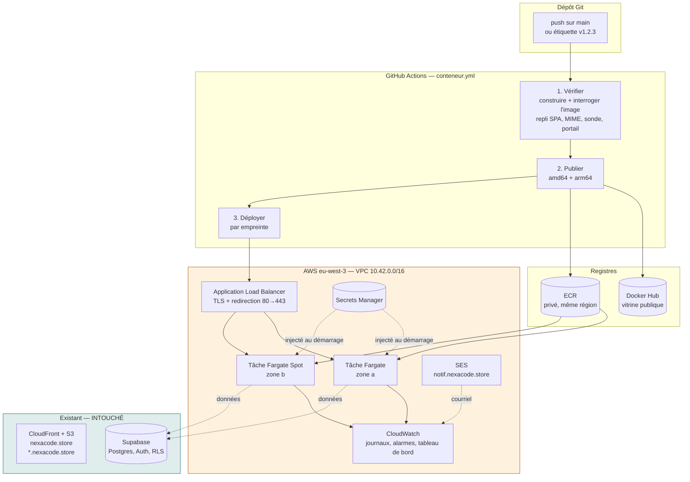

# Déploiement conteneurisé de MUSÉA

> Seconde infrastructure, **à côté** de celle de [`DEPLOY.md`](DEPLOY.md) — pas à sa place.
> Tout le code vit dans [`infra-conteneurs/`](infra-conteneurs/), avec son propre état Terraform.
> **Aucun identifiant AWS n'est demandé ni stocké dans ce dépôt.**

---

## 1. Pourquoi une seconde infrastructure

La première (`infra/`) publie le site sur S3 + CloudFront. Pour du statique
pur, c'est imbattable : une poignée d'euros par mois, un cache mondial, rien à
administrer. **Elle reste la voie par défaut et n'est pas touchée.**

Celle-ci répond à d'autres besoins, qu'un bucket ne couvre pas :

| Besoin | Ce que la voie conteneur apporte |
|---|---|
| **Reproductibilité** | Une image versionnée, la même en local, en recette et en production. « Ça marche chez moi » cesse d'être un argument. |
| **Portabilité** | La même image tourne sur ECS, Kubernetes, App Runner, Scaleway ou un VPS. Aucun verrouillage AWS. |
| **Vérifiabilité** | `docker pull <compte>/musea:v1.2.0` : un tiers exécute exactement ce qui est en production, sans compte AWS. |
| **Évolution** | Le jour où MUSÉA a besoin d'un vrai processus serveur — génération de PDF, traitement d'image, file de photogrammétrie — la place existe déjà. |
| **Exploitation** | Retour arrière automatique, mise à l'échelle sur la charge, sondes de santé, tableau de bord, alertes. |

Les deux voies servent **le même artefact** et peuvent tourner en parallèle.

---

## 2. Ce que ça donne



Adresses obtenues :

| Adresse | Servie par | Statut |
|---|---|---|
| `nexacode.store` | CloudFront (`infra/`) | inchangée |
| `*.nexacode.store` | CloudFront (`infra/`) | inchangée |
| **`conteneurs.nexacode.store`** | ALB → Fargate | **nouvelle** |
| **`notif.nexacode.store`** | SES (expédition seule) | **nouvelle** |

---

## 3. Ce qui garantit que rien ne casse

C'est la question qui compte. Point par point :

| Risque | Ce qui l'écarte |
|---|---|
| Terraform détruit les ressources de `infra/` | État **séparé**. `infra-conteneurs/` ne lit pas `infra/terraform.tfstate` et n'y a aucune référence. Un `destroy` ici ne peut pas toucher ce qu'il ne connaît pas. |
| Collision de noms de ressources | Tout est préfixé `musea-conteneurs-<env>-`. |
| Le site public devient injoignable | La pile n'écrit **qu'un** enregistrement DNS exact (`conteneurs.…`). Route 53 fait primer l'exact sur le joker **pour ce seul nom** ; tous les autres continuent d'aller vers CloudFront. |
| Le sous-domaine d'une organisation est capturé | Ne jamais donner à `sous_domaine` le slug d'un locataire. `conteneurs`, `k8s`, `app` sont sûrs. |
| `EntityAlreadyExists` sur le fournisseur OIDC | Il est **unique par compte** : cette pile le retrouve au lieu de le créer (`creer_fournisseur_oidc_github = false`). |
| Le courrier SendGrid part en indésirable | SES est posé sur un **sous-domaine dédié**. Aucun enregistrement de la racine — SPF, DMARC, `em2987`, `s1/s2._domainkey` — n'est lu ni réécrit. |
| L'application change de comportement | `send-email` garde son ordre de repli : SendGrid, puis Resend, puis SES. Il faut `EMAIL_PROVIDER=ses` pour basculer volontairement. |
| Le `Dockerfile` existant régresse | Le point d'entrée ajouté ne fait **rien** sans variable d'environnement. `docker run --rm -p 8080:8080 musea` se comporte exactement comme avant. |

La sortie Terraform `cohabitation_avec_infra` récapitule, après chaque apply, ce
qui a été écrit dans la zone partagée et ce qui ne l'a pas été.

---

## 4. Ce que ça coûte

Honnêtement, parce que c'est un argument de soutenance à part entière : **la
voie conteneur coûte plus de vingt fois la voie statique.** Ordres de grandeur
mensuels en `eu-west-3`, hors trafic significatif :

| Poste | ECS Fargate | + EKS |
|---|---:|---:|
| Répartiteur de charge | ~16 € | ~16 € |
| Calcul (2 tâches, dont une Spot) | ~13 € | — |
| Plan de contrôle Kubernetes | — | ~68 € |
| Nœuds EKS (2 × t3.small Spot) | — | ~10 € |
| Répartiteur du cluster (NLB) | — | ~16 € |
| ECR, CloudWatch, SES | ~3 € | ~5 € |
| **Total** | **≈ 32 €** | **≈ 115 €** |
| *Rappel : `infra/` (S3 + CloudFront)* | *≈ 1,50 €* | |

D'où deux décisions inscrites dans le code :

- **Pas de passerelle NAT** (~32 €/mois à elle seule). Les tâches vivent dans
  des sous-réseaux publics ; ce qui les protège est le groupe de sécurité, qui
  n'accepte que le répartiteur. Une adresse publique sans port ouvert n'est
  joignable par personne.
- **EKS éteint par défaut.** Les manifestes de `kubernetes/` tournent
  à l'identique sur un cluster local : on démontre Kubernetes sans rien payer,
  et on allume EKS le jour où il sert.

---

## 5. Monter l'infrastructure

### 5.1 Droits de l'utilisateur Terraform

`terraform plan` ne vérifie **que la lecture**. Un plan qui passe ne garantit
rien de l'`apply`. Politiques gérées à attacher :

| Politique | Pour |
|---|---|
| `AmazonVPCFullAccess` | VPC, sous-réseaux, groupes de sécurité |
| `AmazonEC2ContainerRegistryFullAccess` | ECR |
| `AmazonECS_FullAccess` | cluster, service, définitions de tâche |
| `ElasticLoadBalancingFullAccess` | répartiteur, groupe de cibles |
| `AWSCertificateManagerFullAccess` | certificat régional |
| `AmazonRoute53FullAccess` | enregistrements DNS |
| `SecretsManagerReadWrite` | secret applicatif |
| `AmazonSESFullAccess` | identité, DKIM, jeu de configuration |
| `CloudWatchFullAccess` | alarmes, tableau de bord |
| `AmazonSNSFullAccess` | sujet d'alertes |
| `IAMFullAccess` | rôles — **uniquement** si `depot_github` est renseigné |
| `AmazonEKSClusterPolicy` + `AmazonEKSServicePolicy` | **uniquement** si `activer_eks = true` |

### 5.2 Vérifier l'état du compte avant de commencer

```bash
aws iam list-open-id-connect-providers
```

Une entrée `token.actions.githubusercontent.com` ⇒ laisser
`creer_fournisseur_oidc_github = false`. Aucune ⇒ passer à `true`.

### 5.3 Appliquer

```bash
cd infra-conteneurs
cp terraform.tfvars.example terraform.tfvars
```

Puis, après avoir renseigné `terraform.tfvars` :

```bash
terraform -chdir=infra-conteneurs init
```

```bash
terraform -chdir=infra-conteneurs plan -out=tfplan
```

Lire le plan **jusqu'au bout**. Le seul verdict qui compte : la ligne finale ne
doit annoncer **aucune destruction**. Si `destroy` apparaît, arrêter et
comprendre pourquoi avant d'aller plus loin.

```bash
terraform -chdir=infra-conteneurs apply tfplan
```

Compter 5 à 10 minutes : la validation du certificat ACM est l'étape lente.
Si elle dépasse 30 minutes, ce n'est pas la lenteur d'ACM — c'est que la
délégation DNS ne pointe pas vers cette zone.

### 5.4 Renseigner le secret applicatif

Terraform crée le secret **vide** et n'y touche plus jamais (`ignore_changes`).
Les vraies valeurs se posent une fois, à la main — c'est ce qui les tient hors
du dépôt et hors du fichier d'état.

Créer un `valeurs.json` **local, jamais versionné** :

```json
{
  "vite_supabase_url": "https://xxxx.supabase.co",
  "vite_supabase_anon_key": "sb_publishable_xxx",
  "vite_platform_domain": "conteneurs.nexacode.store",
  "basic_auth": ""
}
```

```bash
aws secretsmanager put-secret-value --secret-id musea/production/application --secret-string file://valeurs.json --region eu-west-3
```

> `basic_auth` vide ⇒ site public. Sur un environnement de recette, la forme
> `jury:soutenance` ferme la page d'accueil sans fermer la sonde `/sante`.
> Ce portail empêche l'indexation et l'ouverture par erreur — ce n'est **pas**
> une frontière de sécurité.

Les quatre clés doivent exister, même vides : une clé absente fait échouer le
**démarrage** de la tâche, panne d'autant plus déroutante qu'elle n'apparaît
pas au déploiement.

---

## 6. Brancher le déploiement automatique

`terraform output a_reporter_dans_github` liste tout. Dans
**Settings → Secrets and variables → Actions** :

**Secrets** (chiffrés)

| Nom | Valeur |
|---|---|
| `AWS_ROLE_ARN_CONTENEURS` | sortie `role_deploiement_arn` |
| `DOCKERHUB_USERNAME` | compte Docker Hub — facultatif |
| `DOCKERHUB_TOKEN` | jeton d'accès Docker Hub — facultatif |

`VITE_SUPABASE_URL` et `VITE_SUPABASE_ANON_KEY` existent déjà pour les autres
workflows : ils servent de repli si Secrets Manager n'est pas joignable.

**Variables** (visibles)

| Nom | Valeur |
|---|---|
| `CONTENEUR_DEPLOY_ENABLED` | `true` ← **l'interrupteur** |
| `AWS_REGION` | `eu-west-3` |
| `ECS_CLUSTER`, `ECS_SERVICE`, `ECS_TASK_FAMILY` | sorties correspondantes |
| `SECRET_APPLICATION` | `musea/production/application` |
| `CONTENEUR_DOMAINE` | `conteneurs.nexacode.store` |
| `DOCKERHUB_REPOSITORY` | `<compte>/musea` — facultatif |
| `ECR_REPOSITORY_NAME` | `musea` — sortie du même nom |
| `EKS_CLUSTER`, `EKS_IRSA_ROLE_ARN` | **uniquement** si EKS est allumé |

Tant que `CONTENEUR_DEPLOY_ENABLED` n'est pas à `true`, le workflow construit
et éprouve l'image sur chaque pull request, mais ne publie ni ne déploie rien.

### Publier une version

```bash
git tag -a v1.0.0 -m "Premiere version conteneurisee" && git push origin v1.0.0
```

L'étiquette déclenche la publication sous `v1.0.0`, `1.0`, `1` et
`sha-<court>`, sur ECR **et** Docker Hub, en `amd64` + `arm64`, puis le
déploiement.

---

## 7. Kubernetes

### En local — gratuit, et suffisant pour une démonstration

```bash
docker build -t musea:local --build-arg VITE_SUPABASE_URL=$VITE_SUPABASE_URL --build-arg VITE_SUPABASE_ANON_KEY=$VITE_SUPABASE_ANON_KEY .
```

```bash
kubectl apply -k infra-conteneurs/kubernetes/overlays/local
```

```bash
kubectl -n musea rollout status deployment/musea
```

Le site répond sur <http://localhost:30080>. Voir
[`infra-conteneurs/kubernetes/README.md`](infra-conteneurs/kubernetes/README.md)
pour le déroulé de démonstration : mise à jour progressive sans coupure, pod
tué et remplacé, montée en charge.

### Sur EKS

`activer_eks = true`, `terraform apply`, puis reporter `EKS_CLUSTER` et
`EKS_IRSA_ROLE_ARN` dans les variables du dépôt. Le workflow s'occupe du reste.

---

## 8. SES — la route de courriel

SES **ne remplace pas SendGrid**. Il s'installe à côté, sur son propre
sous-domaine, et devient une seconde route.

### Ce que ça coûte, depuis juillet 2026

⚠️ **Le palier gratuit SES a disparu pour les nouveaux comptes le 21 juillet
2026** (il offrait 3 000 messages/mois pendant 12 mois). Ne pas se fier aux
tutoriels antérieurs, ni au vieux quota « 62 000 messages gratuits depuis EC2 »,
retiré bien avant.

Tout nouveau compte démarre sur le plan **Essentials**, sans abonnement :

| Plan | Abonnement | Prix (0–10 M messages) |
|---|---:|---:|
| **Essentials** | aucun | **0,16 $ / 1 000** |
| Pro | 105 $/mois | 0,22 $ / 1 000 |
| Enterprise | 500 $/mois | 0,23 $ / 1 000 |

À l'échelle de MUSÉA — quelques milliers de messages par mois — cela fait
**moins d'un dollar**. Essentials suffit ; Pro et Enterprise n'apportent que des
fonctions de délivrabilité utiles à partir de campagnes massives.

Les 200 $ de crédits « AWS Free Tier » ne concernent que les comptes de moins de
six mois : le compte MUSÉA, ouvert bien avant, n'y a pas droit.

Après l'apply, vérifier que la délégation a pris :

```bash
aws ses get-identity-verification-attributes --identities notif.nexacode.store --region eu-west-3
```

`Success` ⇒ DKIM en place. Compter jusqu'à 15 minutes.

> ⚠️ **Le piège qui fait rater les démonstrations.** Un compte SES neuf est en
> *bac à sable* : il n'expédie **qu'aux adresses vérifiées**, 200 messages par
> jour. Les enregistrements DNS peuvent être parfaits et le message rester
> bloqué. La sortie se demande dans **SES → Account dashboard → Request
> production access** et prend environ 24 h. **À faire avant la soutenance.**

Pour faire expédier les Edge Functions par SES : `creer_utilisateur_ses = true`,
puis

```bash
terraform -chdir=infra-conteneurs output -raw identifiants_smtp_ses
```

et poser côté Supabase `AWS_SES_ACCESS_KEY_ID`, `AWS_SES_SECRET_ACCESS_KEY`,
`AWS_SES_REGION`, `AWS_SES_CONFIGURATION_SET`, `EMAIL_FROM`. **Sans
`EMAIL_PROVIDER=ses`, rien ne bascule** : SendGrid reste prioritaire tant que sa
clé est là. C'est volontaire — on bascule quand on l'a décidé, pas par
accident.

---

## 9. Revenir en arrière

Trois filets, du plus automatique au plus manuel :

1. **Le disjoncteur ECS.** Si les nouvelles tâches ne deviennent pas saines,
   ECS remet la version précédente **tout seul** et le workflow échoue. Le site
   ne tombe pas. Rien à faire.
2. **Revenir à une révision.** Les 15 dernières images sont conservées dans ECR.

   ```bash
   aws ecs update-service --cluster musea-conteneurs-production-cluster --service musea-conteneurs-production --task-definition musea-conteneurs-production:42 --force-new-deployment
   ```

3. **Sous Kubernetes.**

   ```bash
   kubectl -n musea rollout undo deployment/musea
   ```

Et le filet ultime, qui n'a rien à voir avec les conteneurs : `nexacode.store`
continue d'être servi par CloudFront pendant tout ce temps.

---

## 10. Pièges connus

| Symptôme | Cause réelle |
|---|---|
| Tâche en boucle `STOPPED`, sans journal | Une clé manque dans le secret JSON. L'agent échoue **avant** de démarrer le conteneur, donc avant tout journal applicatif. `aws ecs describe-tasks` donne `stoppedReason`. |
| Toutes les cibles « unhealthy », le conteneur tourne | La sonde vise `/` alors que le portail d'accès est actif → 401. Elle doit viser `/sante`. |
| `InvalidParameterException` à l'enregistrement de la tâche | `describe-task-definition` rend des champs que `register` refuse. Le `jq` du workflow les retire ; ne pas le contourner. |
| Certificat bloqué en `PENDING_VALIDATION` | La délégation DNS ne pointe pas vers cette zone. `nslookup -type=NS nexacode.store 8.8.8.8` doit rendre 4 serveurs `awsdns`. |
| Pods `ErrImagePull` sur EKS | Le rôle des nœuds n'a pas `AmazonEC2ContainerRegistryReadOnly`. |
| Ingress ALB sans adresse, sans message | Le contrôleur AWS Load Balancer n'est pas installé. Il ne fait pas partie d'EKS. |
| SES : 403 « Email address is not verified » | Bac à sable. Voir §8. |
| SES : 403 « Signature does not match » | Clé secrète erronée, ou horloge décalée de plus de 5 minutes. |
| `EntityAlreadyExists` sur le fournisseur OIDC | `creer_fournisseur_oidc_github` doit être `false` : le compte en a déjà un. |

---

## 11. Démonter

```bash
terraform -chdir=infra-conteneurs destroy
```

Ne touche **que** cette pile. `infra/` — bucket, CloudFront, DNS de la racine —
reste intact, et le site public continue de répondre pendant et après.
