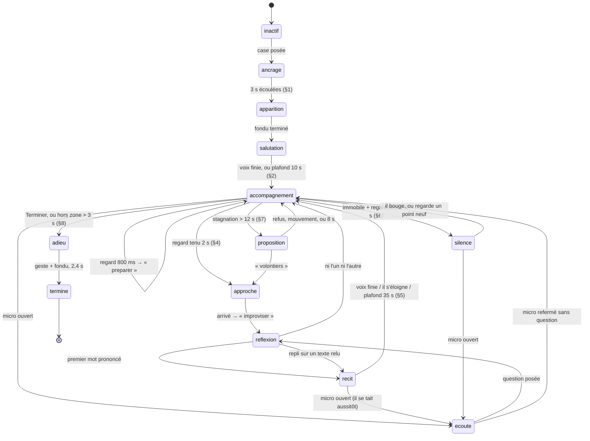

# Guide Spectral — réalité augmentée spatiale, parole en direct

Le visiteur scanne un espace vide avec son téléphone. Une case traditionnelle
apparaît à sa taille réelle. Un avatar semi-transparent l'accompagne, voit ce
qu'il regarde, **improvise** ce qu'il lui raconte, et **répond à ses questions**.

Ce document décrit ce qui a été construit, et pourquoi. Il complète
`MUSEA_MASTER_PLAN.md`, dont il ne répète pas les principes généraux.

---

## 0. Deux écarts avec le cahier des charges, assumés

### La pile technique

Imposé : **React Native + Expo + ViroReact**, ou **WebXR + Three.js +
@react-three/xr** en variante PWA, avec **AppSync + IoT Core + Cognito +
Aurora**. MUSÉA est une application **Vue 3 + Vite** adossée à **Supabase**.

| Imposé | Retenu | Raison |
|---|---|---|
| ViroReact / react-native-arkit | **WebXR + Three.js**, sans liant React | ViroReact suppose React Native : une seconde application, un second pipeline, un second magasin d'identifiants, pour rendre la même API `immersive-ar`. `@react-three/xr` n'est qu'un liant React autour de ces mêmes appels. **Le renoncement porte sur le liant, pas sur la technique.** |
| AppSync + IoT Core | **Supabase** (PostgREST + Realtime) | La visite est mono-utilisateur : rien n'a besoin d'être diffusé à d'autres appareils. Ils redeviendront pertinents pour une visite **partagée** (§9). |
| Cognito + Aurora | **Supabase Auth + PostgreSQL RLS** | Le cloisonnement multi-locataire existe déjà, éprouvé sur quinze tables. En introduire un second, incompatible, créerait la faille qu'on cherche à éviter. |
| Amazon Bedrock (Claude) | **Bedrock, Claude Sonnet 4.5 en direct** | `_shared/bedrock.ts` le câblait déjà en attente ; on y a ajouté la **diffusion** (`ConverseStream`). |
| Amazon Polly / ElevenLabs | **`src/services/tts.js`**, provider par musée | Abstraction déjà en place. `polly` est accepté dans le schéma et emprunte aujourd'hui la voie ElevenLabs. |
| S3 + CloudFront | **inchangé** | `infra/` sert déjà les médias par CloudFront. |

Contrainte du poste : **`npm` est hors service** (`MUSEA_MASTER_PLAN` §6). Aucune
dépendance installée ; `three@0.183.2` était déjà présent dans `node_modules`.

### La validation humaine — et c'est le point qui compte

Le cahier des charges demandait à la fois que le guide **improvise** et que
*« tous les contenus narratifs passent par validation humaine avant
publication »*. Les deux ne peuvent pas être vrais ensemble : **un texte qui
n'existe qu'à l'instant où il est prononcé ne peut pas avoir été relu la
veille.** Prétendre le contraire serait un mensonge de conception.

Ce qui a été retenu, et qui n'est pas moins exigeant :

| Exigence | Comment elle est tenue |
|---|---|
| Le guide n'invente pas de faits | Le corpus transmis au modèle est **exactement** les notices publiées rattachées aux points chauds. Rien d'autre : pas de recherche élargie, pas de « culture générale ». On ne contrôle plus la phrase, on contrôle **ce qu'elle peut dire**. |
| Ne pas savoir | L'aveu d'ignorance est une réponse **explicitement autorisée** par le prompt, et détectée à la trace (`ar_improvisations.aveu`). C'est le garde-fou le plus important, parce qu'un modèle sommé de répondre répond toujours. |
| Relecture | Elle a lieu **après coup**. Tout ce qui a été dit est enregistré : texte, question, modèle, sources, latence. Le conservateur ne relit plus un brouillon, il **écoute son guide**. |
| Le visiteur n'est pas sans recours | Un bouton de **signalement** sur chaque parole du guide. C'est le seul geste d'écriture qui lui est laissé, et il remonte immédiatement dans la file du conservateur. |
| Rien ne se perd | Une improvisation réussie se **promeut** en récit canonique (`ar_promouvoir_improvisation`), ce qui la fige, la fait relire et la rend disponible hors ligne. |

**`ar_recits` n'a pas disparu : il est devenu le repli.** Réseau coupé, Bedrock
indisponible, quota épuisé, musée qui préfère des textes relus — le guide
retombe sur des récits écrits d'avance plutôt que de se taire. Les deux
systèmes se complètent au lieu de se concurrencer.

---

## 1. Architecture

```
                       TÉLÉPHONE (PWA, HTTPS obligatoire)
  ┌──────────────────────────────────────────────────────────────────┐
  │  PublicSpectral.vue        route /site/spectral/:id[?audio=1]    │
  │       └─ SpectralGuide.vue                                       │
  │            ├─ FILE DE PAROLE  phrase par phrase → tts.js         │
  │            ├─ micro (SpeechRecognition) + saisie de secours      │
  │            ├─ spectralLive.js  ── flux SSE, découpe en phrases   │
  │            └─ spectralEngine.js  ── WebXR + Three.js             │
  │                   ├─ hit-test → ancrage → XRAnchor               │
  │                   ├─ GLTFLoader + Draco + meshopt                │
  │                   ├─ gaze.js       colliders + rayon + fixation  │
  │                   └─ avatarState.js  machine à états (PURE)      │
  └────────┬─────────────────────────────┬───────────────┬───────────┘
           │ lecture (RLS, publié)       │ SSE           │ Cache Storage
           ▼                             ▼               ▼ + localStorage
  ┌────────────────────────┐   ┌──────────────────────┐ ┌──────────────┐
  │ Supabase — PostgreSQL  │   │ Edge  guide-spectral │ │ hors ligne   │
  │ ar_scenes/ar_hotspots  │◀──│      -live           │ │ modèles +    │
  │ ar_recits (repli)      │   │  corpus → Bedrock    │ │ récits relus │
  │ ar_improvisations      │◀──│  ConverseStream      │ └──────────────┘
  │ ar_avatar_configs      │   │  Claude Sonnet 4.5   │
  │ ar_events              │   └──────────────────────┘
  └───────────┬────────────┘
              │                ┌──────────────────────┐
  ┌───────────▼────────────┐   │ Edge  guide-spectral │
  │ ERP (personnel)        │──▶│  rédaction du REPLI  │
  │ surveillance + promo-  │◀──│  → Bedrock (attente) │
  │ tion + relecture       │   └──────────────────────┘
  └────────────────────────┘
```

### Le partage des responsabilités

- **`avatarState.js` — le tempérament.** Aucun import : ni Three.js, ni DOM, ni
  Vue. Il reçoit une *perception*, rend des *actions*. Testable au banc en
  faisant avancer l'horloge à la main (`scripts/test-guide-spectral.mjs`,
  **61 vérifications**).
- **`spectralEngine.js` — la géométrie.** Ancrage, chargement, placement, rayon
  du regard. Il ne sait pas ce qu'est un récit : il transmet.
- **`spectralLive.js` — le ruisseau.** Consomme le flux SSE et le recompose en
  phrases prononçables.
- **`SpectralGuide.vue` — la parole.** File d'attente, micro, sous-titres,
  signalement. C'est cette frontière qui rend le **mode audio-seul** possible
  sans dupliquer une ligne.

---

## 2. La latence, qui est le vrai sujet

Un guide qui met trois secondes à répondre n'est pas un guide, c'est un
formulaire. Trois mécanismes se combinent pour que la parole parte **avant** que
le visiteur ait le temps de trouver ça long.

### Diffusion (`ConverseStream`)

`_shared/bedrock.ts` gagne `appelerBedrockFlux()`. Bedrock ne répond pas en SSE
mais en `vnd.amazon.eventstream`, un cadrage binaire propriétaire : le format est
analysé à la main, comme SigV4 l'était déjà, **pour ne pas faire entrer une
dépendance dans un fichier qui manipule des identifiants AWS**. Quarante lignes,
et les CRC ne sont pas vérifiés — TLS garantit mieux que CRC32 qu'aucun octet
n'a bougé.

La première phrase arrive en 500–800 ms au lieu de 2–4 s. **La voix devient le
tampon** : pendant qu'elle prononce la phrase 1 (2 à 3 s), la phrase 3 s'écrit.

### Anticipation

La génération part à **800 ms de fixation**, bien avant que les 2 000 ms la
valident.

```
0 ms ─── regard se pose
800 ms ─ ▶ requête partie (action « preparer »)
2000 ms ─ fixation validée  ← 1,2 s déjà gagnées
2000-4600 ms ─ le guide marche vers l'élément (APPROCHE)
                ← 2,6 s de plus
≈4600 ms ─ il doit parler. La première phrase est prête depuis longtemps.
```

Près de **quatre secondes de couverture**. Le pari est presque toujours bon : un
regard tenu une seconde se tient rarement moins de deux. Et **un regard qui se
détourne annule la requête** (`annulerPreparation` → `AbortController` →
`stream.cancel()` côté serveur), donc ne la paie pas.

### Le panneau de préparation, qui n'est pas de la politesse

`requestSession('immersive-ar')` exige une **activation utilisateur** : le
navigateur n'ouvre la caméra que dans la foulée immédiate d'un geste. La
première version chargeait le modèle *puis* demandait la session — treize
méga-octets mesurés à **75 secondes** depuis le stockage. L'attente consommait
l'activation, et Chrome refusait : le visiteur appuyait, patientait, rien ne
s'ouvrait. Invisible en développement, où le modèle arrive en 300 ms.

Le moteur est donc en deux temps : `preparer()` télécharge pendant que le
visiteur lit la marche à suivre, `demarrer()` n'ouvre plus que la session. Le
panneau en trois étapes — pointer, balayer lentement, toucher pour poser — est
ce qui rend l'ouverture possible, et le bouton « Lancer » reste désactivé tant
que le modèle n'est pas là.

Le panneau est aussi le seul endroit où le **diagnostic** peut se dire. D'où une
règle contre-intuitive : le bouton d'entrée s'affiche **même quand l'appareil ne
suivra pas**. Le masquer paraissait propre et rendait l'explication
inatteignable — sur un iPhone, `navigator.xr` n'existe pas, le bouton
disparaissait, et le visiteur n'apprenait jamais pourquoi.

### L'état RÉFLEXION

Quand malgré tout le premier mot se fait attendre, le guide **a l'air de
chercher ses mots** — trois points qui respirent, une animation `think`. Sans
cet état, il reste figé une seconde et l'on conclut au plantage. Au-delà de
5 s, ou dès que le serveur annonce un échec (`signalerEchecImprovisation`), il
se rabat sur un texte relu **sans que le visiteur sache qu'il s'est passé
quelque chose**.

### Ce que le prompt doit à la diffusion

Une contrainte qu'on n'attend pas et qu'il est facile d'oublier :

> Ta PREMIÈRE PHRASE est courte et se suffit à elle-même. Elle sera prononcée
> pendant que tu rédiges la suite : ne commence jamais par une subordonnée, ni
> par une formule d'attente du type « alors », « eh bien », « c'est une bonne
> question ».

Si elle commence par une subordonnée, la voix s'arrête au milieu d'une
proposition et l'illusion tombe.

### Performance graphique

| Levier | Valeur |
|---|---|
| `framebufferScaleFactor` | 0,85 avant `setSession` |
| Draco + meshopt | ~40 Mo → 4–8 Mo pour une case texturée |
| `depthWrite = false` sur l'avatar | supprime le tri des transparences |
| Vecteurs préalloués | zéro allocation par image |
| Colliders sphériques, `colorWrite: false` | 7 par scène, gratuits au rendu |

Au-delà de **40 ms par image (~25 im/s)**, trois paliers du moins au plus
nuisible : *foveation* → animation à 30 Hz → regard une image sur deux.
Trois secondes minimum entre deux paliers, **et jamais de retour en arrière** :
osciller se remarque davantage qu'une qualité constante un peu inférieure.

---

## 3. Points chauds et raycast

### Les sept points

Repère de la **case** : mètres, origine au centre du sol, Y vers le haut,
**+Z vers l'entrée**. Posés par `ar_semer_points()` pour un *tolek* de 6 m.

| Code | Libellé | x | y | z | rayon | priorité |
|---|---|---:|---:|---:|---:|---:|
| `seuil` | Le seuil | 0 | 1,00 | **+2,55** | 0,55 | 1 |
| `foyer` | Le foyer central | 0 | 0,35 | 0 | 0,70 | 2 |
| `poteaux` | Nervures sculptées | −2,05 | 1,60 | 1,30 | 0,50 | 3 |
| `couchage` | Zone de couchage | −1,60 | 0,50 | −1,20 | 0,80 | 4 |
| `grenier` | Le grenier | 1,70 | 1,50 | −1,30 | 0,70 | 5 |
| `toit` | La voûte | 0 | 3,60 | 0 | **1,60** | 6 |
| `sortie` | La sortie | 0 | 1,20 | **+4,20** | 0,90 | 7 |

- **Seuil et sortie sont le même passage**, distingués par *où se tient le
  visiteur* : le seuil à l'intérieur, la sortie dehors. Depuis le foyer, le
  rayon rencontre le seuil en premier. Une fois passé, le seuil est derrière et
  la sortie répond. **Aucune logique supplémentaire** : la règle « le premier
  point touché fait foi » suffit à distinguer entrer de sortir.
- **Le collider du toit est trois fois plus large.** On vise mal, tête en
  arrière : un rayon serré ne serait jamais tenu deux secondes.
- **« Poteaux sculptés » devient « Nervures sculptées » sur un *tolek*.** La
  case obus mousgoum est une coque de terre à profil de chaînette : pas de
  poteaux porteurs, un décor de nervures modelées en relief sur la paroi, qui
  servent aussi d'échafaudage. Les poteaux sculptés sont bamiléké. Le code reste
  `poteaux`, le libellé suit l'archétype : annoncer des poteaux là où il n'y en
  a pas serait la première contrevérité de la visite, dite par le décor lui-même.

### Trois constantes qui ne sont pas des constantes

Le tempérament du guide est calibré sur un tolek de six mètres. Trois valeurs ne
se transposent pas à une concession de vingt, et le moteur les **dérive de
`emprise_m`** au lieu de les figer :

| Réglage | Tolek 6 m | Relevé Fondation 19,7 m | Ce qui cassait sans cela |
|---|---:|---:|---|
| Portée du rayon du regard | 12 m | **31,5 m** | La sortie est à 23,6 m d'un visiteur posté au bord opposé : le rayon s'arrêtait avant, ce point n'aurait **jamais** pu être regardé. |
| Rayon de la zone | 14 m | **23,6 m** | Le guide prenait congé alors que le visiteur marchait encore vers le seuil, situé à 13,8 m. |
| Attente d'approche | 3,0 s | **7,6 s** | À 1,5 m/s, traverser la case prend six secondes : le guide commençait son récit à mi-chemin. |

Ce ne sont pas des réglages d'ambiance, ce sont des conséquences géométriques :
elles n'ont rien à faire dans un formulaire. Les points chauds eux-mêmes sont
dilatés de la même façon, mais en base (`ar_semer_points`).

### Le rayon

Il n'y a pas d'oculométrie sur un téléphone. « Ce que le visiteur regarde » est
« ce qu'il a mis au centre de son écran et y a laissé ». Approximation, mais
honnête : pointer un objet avec son téléphone **est** un geste d'attention.

```
origine   = position monde de la caméra XR
direction = −Z de sa matrice monde        ← le « centre de l'écran » en AR
portée    = 12 m
cibles    = colliders + coque de la case
retenu    = premier touché, s'il porte un hotspotId
```

En session immersive il n'y a plus de curseur ni de *viewport* unique : **il ne
faut surtout pas** convertir des coordonnées souris.

| Problème | Sans traitement | Traitement |
|---|---|---|
| La main tremble | le rayon sort du collider dix fois par seconde, la fixation n'aboutit jamais | **hystérésis** : une perte < 220 ms fait avancer le compteur à demi-crédit au lieu de le remettre à zéro |
| Balayer n'est pas regarder | tourner la tête déclenche tous les récits traversés | **stabilité** : direction mémorisée au début, écart > 9° et la fixation redémarre |
| On voit à travers les murs | le grenier se déclenche en regardant la paroi qui le cache | **occlusion** : la coque est dans les cibles ; touchée en premier, elle masque le point |

---

## 4. Machine à états



**La règle qui gouverne tout : le guide se tait par défaut.** Chaque prise de
parole doit être justifiée par un geste du visiteur — un regard tenu, une
question, ou une stagnation.

### Cinq décisions qui font le tempérament

**Contemplation ≠ stagnation.** Les deux sont « immobile ». Ce qui les sépare
tient à `regard.stable`. Arrêté **en regardant quelque chose** = absorbé, le
guide se tait. Arrêté **sans rien fixer** = perdu, le guide propose. Toute la
différence entre respecter et abandonner tient dans ce booléen.

**Les six secondes se comptent après la dernière phrase.** Le banc d'essai a
révélé le contraire dans la première version : le compteur d'immobilité courait
*pendant* le récit, si bien qu'un visiteur resté sagement immobile pour écouter
basculait en « silence contemplatif » à l'instant précis où le guide se taisait.
`finDeParole()` remet les compteurs à zéro. Le genre de défaut qu'on ne voit pas
en lisant le code, et pas davantage sur le terrain — on le trouve en mesurant.

**Il se tait au premier pas d'horloge quand on lui parle.** Pas à la fin de sa
phrase : au pas suivant. Une voix de synthèse qui poursuit pendant qu'on essaie
de l'interrompre, c'est exactement ce qui fait renoncer à parler aux assistants
vocaux.

**Une question ne consomme pas le point regardé.** Demander « qui dormait ici ? »
devant le foyer n'épuise pas le récit du foyer : le visiteur y a toujours droit.

**Un refus double le délai.** `PALIERS_REFUS = [1, 2, 4, 8]` : après un « plus
tard », la relance attend 24 s, puis 48, puis 96.

### Le banc d'essai

```bash
node scripts/test-guide-spectral.mjs
```

**61 vérifications.** Les plus utiles contrôlent que **rien ne se produit** :
aucune parole pendant vingt secondes de contemplation, aucune relance avant
douze secondes, aucun récit sur un regard instable, **rien de dit pendant qu'on
parle au guide**, aucune requête pour un regard qui se détourne. Un guide trop
bavard ne se détecte pas à l'œil.

---

## 5. Les prompts

Deux, pour deux régimes. Ils partagent leurs interdits et diffèrent sur ce que
la diffusion impose.

| | `guide-spectral-live` (direct) | `guide-spectral` (repli) |
|---|---|---|
| Fichier | `promptDirect()` | `promptSysteme()` |
| Modèle | Sonnet 4.5, **configurable par musée** | Sonnet 4.5 |
| Température | **0,7** — parole vivante | 0,35 — fidélité |
| Sortie | **texte brut**, il part à la voix | JSON strict, il part en base |
| Longueur | 40–90 mots (récit), 25–65 (réponse) | 40–90 mots |
| Ne pas savoir | **le dire à voix haute**, en une phrase | `{"insuffisant": true, "manque": "…"}` |
| Contrainte propre | **première phrase courte et autonome** | indices des sources utilisées |

La température plus haute en direct mérite une justification, parce qu'elle
paraît contre-intuitive : **le garde-fou contre l'invention n'est pas la
température, c'est le corpus.** La baisser n'ajouterait aucune sécurité et
ferait resservir la même tournure au troisième point chaud.

Structure commune, et l'intention de chaque section :

| Section | Ce qu'elle fait |
|---|---|
| **Cadre** | Le visiteur est *debout, à l'intérieur*, il vient de poser les yeux sur un élément. Le modèle écrit une parole, pas une notice. |
| **Sources — la règle absolue** | Quatre interdits nommés : pas de date/chiffre, pas de nom propre, pas de fonction rituelle, pas de comparaison — hors des notices. Et la formule qui porte : *« un fait absent des notices n'est pas un fait à retrouver dans ta mémoire »*. |
| **Ne pas savoir est une réponse** | *« Ça, je ne le sais pas. Ce que je peux te dire, c'est… »* Un guide qui avoue vaut mieux qu'un guide qui invente, et le visiteur entend la différence. |
| **Comment tu parles** | Première phrase autonome, tutoiement, partir du concret, une seule idée, ne jamais se répéter, finir sans question. **Aucune mise en forme** : ce texte sera prononcé. |
| **Registre** | Proscrit « primitif », « ancestral », « tribal », « authentique », « mystérieux », « âme africaine » ; proscrit « on raconte que » et « il semblerait », qui donnent le poids d'une source à une absence de source. |
| **Hors domaine** | Météo, actualité, politique : décliner en une phrase et ramener à la case. **Ne jamais dire qu'il est un modèle de langage** — il est le guide de ce musée. |
| **Persona** | Injecté depuis `ar_avatar_configs.persona`. C'est ainsi qu'une chefferie donne une **voix** à son guide plutôt qu'un ton neutre de notice. |

Un `ANGLES` par code de point (« le seuil : qui entre, qui n'entre pas… », « le
toit : comment la forme tient debout… ») évite que les sept récits racontent
sept fois « la vie quotidienne dans la case ».

### Ce qui se passe autour du modèle

**Avant :** le corpus est élargi à **toute la case**, avec le point regardé
marqué d'une étoile. Un visiteur qui demande « et le grenier ? » devant le foyer
parle de la même maison ; restreindre au seul point regardé donnerait un guide
obtus. Hors sujet détecté par expression régulière **avant** l'appel : inutile
de payer une inférence pour apprendre que la question portait sur le football.

**Après (voie repli uniquement) :** longueur hors bornes → écarté ; aucune
source déclarée → écarté, c'est par construction une invention ; statut
`en_relecture`, jamais `publie`.

**Après (voie directe) :** tout est enregistré dans `ar_improvisations`, avec la
latence du **premier mot** — celle que le visiteur ressent, pas celle de la fin.

---

## 6. Schéma de données

`20260828_guide_spectral.sql` puis `20260828_guide_spectral_direct.sql`.

| Table | Rôle | Colonnes qui portent une décision |
|---|---|---|
| `ar_scenes` | la case ancrable | `emprise_m`, `hauteur_m` : disent « reculez de deux pas » **avant** l'ancrage. `modele_ios_url` : repli Quick Look. |
| `ar_hotspots` | les sept points | `code` fermé par CHECK. `rayon`, `pose_avatar`. `notices` : **le seul corpus** transmis au modèle. |
| `ar_recits` | le **repli** relu | `statut`, `valide_par`, `variante`, `duree_s` borné 15–35. |
| `ar_improvisations` | **ce qui a été dit** | `question`, `texte`, `latence_ms`, `aveu`, `signale`, `recit_id`. |
| `ar_avatar_configs` | le tempérament | toutes les bornes du cahier des charges en CHECK ; `modele`, `persona`, `improvisation`, `questions_ouvertes`. |
| `ar_events` | télémétrie anonyme | `session` tiré dans le navigateur, jamais lié à un compte. |

### Quatre partis pris qui se lisent dans le schéma

**Le cahier des charges est encodé en contraintes.**

```sql
delai_apparition_ms  CHECK (BETWEEN 2500 AND 3500)   -- §1
salutation_max_s     CHECK (BETWEEN 8 AND 12)        -- §2
distance_min_m       CHECK (>= 1.5 AND <= 2.0)       -- §3
fixation_ms          CHECK (BETWEEN 1800 AND 2200)   -- §4
duree_s              CHECK (BETWEEN 15 AND 35)       -- §5
silence_contemplatif_s CHECK (>= 6)                  -- §6
relance_stagnation_s   CHECK (>= 12)                 -- §7
```

L'ERP règle le guide ; il ne peut pas le dénaturer. Un réglage hors bornes est
refusé par la base, pas par une validation d'interface qu'un appel REST direct
contournerait.

**Le modèle est une colonne, pas une constante.** Les identifiants de modèles se
périment — le projet l'a déjà vécu avec Groq et Gemini. Changer de Claude doit
être un `UPDATE`, pas un redéploiement.

**Le visiteur peut signaler, il ne peut pas réécrire.** La politique RLS autorise
l'`UPDATE`, mais un déclencheur **restaure** toutes les colonnes sauf `signale`
et `motif`. Sans cela, un visiteur pourrait fabriquer une citation que le guide
n'a jamais prononcée. On restaure au lieu de lever une exception : signaler ne
doit pas échouer parce qu'un client a renvoyé la ligne entière.

**`ar_events` et `ar_improvisations` n'utilisent pas `set_tenant_id`.** Ce sont
les seules tables écrites par un **visiteur anonyme**, et ce déclencheur rattache
à l'organisation du *membre du personnel* qui insère. Un visiteur n'en a pas
(« un visiteur n'est jamais `profiles.tenant_id` », `MUSEA_MASTER_PLAN` §3) : les
traces seraient arrivées avec `tenant_id` NULL et `can_manage_tenant()` les
aurait rendues **invisibles à tout le monde**. Des déclencheurs dédiés héritent
du locataire de la scène.

---

## 7. Cloisonnement multi-locataire

1. **RLS** sur les sept tables, avec la cascade publication : organisation
   publique + musée publié + scène publiée.
2. **Filtre `tenant_id` explicite** côté client (`services/spectral.js`). La RLS
   distingue *publié* de *non publié*, pas *chez moi* de *chez le voisin*.
3. **Le tenant n'est jamais envoyé par le navigateur** vers la fonction en
   direct : il est déduit de la scène côté serveur. Le laisser choisir sa cible
   à qui sait forger une requête serait le trou par lequel passe tout le reste.
4. **La fonction de rédaction porte le jeton du conservateur**, jamais la clé de
   service.

---

## 8. Ce qui tourne, ce qui manque

**Fait et vérifié**

- Deux migrations : 7 tables, RLS, déclencheurs de validation, d'héritage et de
  garde, amorçage des 7 points, promotion d'une improvisation.
- Diffusion Bedrock (`ConverseStream`) avec analyse du cadrage binaire.
- Fonction en direct : corpus élargi, historique, contexte, aveu, trace, repli.
- Machine à états — **61/61** au banc.
- Moteur WebXR : hit-test, `XRAnchor`, Draco + meshopt, avatar spectral, suivi
  latéral, régulation d'images/s.
- Regard : colliders, occlusion, hystérésis, stabilité, **anticipation**.
- Vue : file de parole, micro, sous-titres, réflexion, signalement, audio-seul,
  préchargement hors ligne.
- `npx vite build` passe ; Three.js reste dans un fragment chargé à la demande.

**Manquant — et rien de tout cela n'est du code**

1. **Le modèle 3D de la case** (photogrammétrie en place → export Draco+meshopt).
2. **L'avatar riggé** : Ready Player Me convient. Clips `idle`, `walk`, `talk`,
   `greet`, `farewell`, plus **`think`** et **`listen`** que le direct ajoute.
   La reconnaissance des noms est tolérante (`nomDeClip`).
3. **Les écrans ERP** : édition des points, **file de surveillance des
   improvisations** (signalées d'abord, puis les aveux), promotion, rédaction du
   repli, relecture.
4. **Un essai sur téléphone Android/Chrome en HTTPS.**

**Ce qui n'a pas pu être vérifié sur ce poste** : ni `deno` ni `psql` n'y sont
installés. **Les migrations n'ont pas été jouées, les fonctions Edge n'ont pas
été typées, et l'analyseur `vnd.amazon.eventstream` n'a jamais vu un octet
réel de Bedrock** — c'est la pièce à surveiller en premier à la mise en service.
Ce qui l'a été : `node scripts/test-guide-spectral.mjs` (61/61) et `npx vite build`.

**Ordre suggéré** : (3) d'abord — sans écran de surveillance, personne ne sait ce
que le guide raconte, et c'est le corollaire direct de l'improvisation. Puis (4)
pour mesurer la latence réelle, puis (1) et (2).

---

## 9. Accessibilité et suites

- **Mode audio-seul** : `?audio=1`, ou automatique sans WebXR. Même machine,
  même parole, même improvisation ; le regard est remplacé par des boutons et
  la question par un champ de saisie. Pas un repli au rabais : le même code.
- **Sous-titres** activés par défaut, affichés par `dom-overlay` par-dessus la
  caméra, avec `aria-live` sur la parole du guide.
- **Le micro n'est jamais obligatoire.** `SpeechRecognition` n'existe pas
  partout et son comportement en session immersive n'est garanti nulle part :
  le champ de saisie reste offert, et le guide fonctionne entièrement sans.
- **Débit de parole** réglable par musée ; `prefers-reduced-motion` respecté.

**Suites**

- **Cache de prompt Bedrock** (`cachePoint`) : le système et le corpus sont
  stables par scène et renvoyés à chaque tour. Gain net en latence et en coût.
  Non posé faute de pouvoir l'essayer : un champ non pris en charge ferait
  échouer tout l'appel.
- **Visite partagée** : c'est là qu'AppSync ou Realtime redeviennent pertinents.
- **Voix pré-synthétisées à la publication** des récits de repli.
- **Occlusion par la profondeur** (`depth-sensing`) : la case passerait derrière
  un vrai mur au lieu de le traverser.
